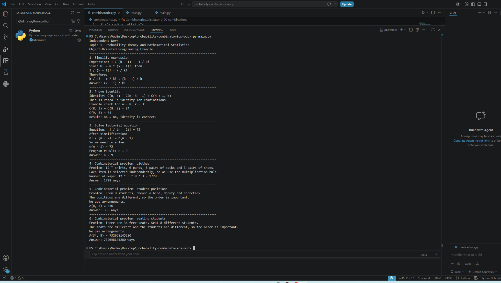

# Самостійна робота  
## Тема 1. Теорія ймовірностей та математична статистика

**Виконав:** Вівчар Вадим Вікторович  
**Група:** АЛК-43  
**Факультет:** Інженерія програмного забезпечення  

---

## Опис проєкту

Цей репозиторій містить приклад використання комбінаторних формул в об'єктно-орієнтованому програмуванні.

Проєкт демонструє, як формули теорії ймовірностей і комбінаторики можна застосовувати не лише під час ручних розрахунків, а й у програмному коді з використанням класів, об'єктів, методів та наслідування.

---

## Мета роботи

Закріпити навички застосування формул комбінаторики, зокрема факторіалів, перестановок, розміщень і сполучень, а також показати приклад їх практичного використання в об'єктно-орієнтованому програмуванні.

---

## Що демонструє програма

У програмі реалізовано:

- обчислення факторіала;
- обчислення перестановок;
- обчислення розміщень;
- обчислення сполучень;
- застосування правила множення;
- перевірку тотожності Паскаля;
- розв'язання прикладних комбінаторних задач.

---

## Об'єктно-орієнтований підхід

У проєкті використано принципи ООП:

- `CombinatoricsCalculator` — клас, який містить основні формули комбінаторики;
- `Task` — базовий клас для задач;
- окремі класи задач наслідують базовий клас `Task`;
- кожна задача має власний метод `solve()`;
- `main.py` створює об'єкти задач і запускає їх через спільний інтерфейс.

Таким чином, математичні формули комбінаторики використовуються як частина об'єктно-орієнтованої програмної моделі.

---

## Структура проєкту

```text
probability-combinatorics-oop/
│
├── combinatorics.py
├── tasks.py
├── main.py
├── README.md
└── screenshotsrun_result.png
```

---

## Опис файлів

- `combinatorics.py` — клас із формулами комбінаторики;
- `tasks.py` — класи прикладних задач;
- `main.py` — головний файл для запуску програми;
- `README.md` — опис проєкту;
- `screenshotsrun_result.png` — скріншот запуску програми.

---

## Приклади задач у програмі

Програма демонструє використання комбінаторики на таких прикладах:

1. Спрощення комбінаторного виразу.
2. Перевірка тотожності Паскаля.
3. Розв'язання рівняння з факторіалами.
4. Обчислення кількості способів вибору одягу.
5. Обчислення кількості способів розподілу студентських посад.
6. Обчислення кількості способів розсадження учнів.

---

## Запуск програми

Для запуску програми потрібно виконати команду:

```bash
py main.py
```

або:

```bash
python main.py
```

---

## Результат виконання

Після запуску програма створює об'єкти задач, викликає метод `solve()` для кожної задачі та виводить результати розрахунків.

Скріншот запуску програми:



---

## Висновок

У проєкті показано практичний приклад використання комбінаторики в об'єктно-орієнтованому програмуванні.


